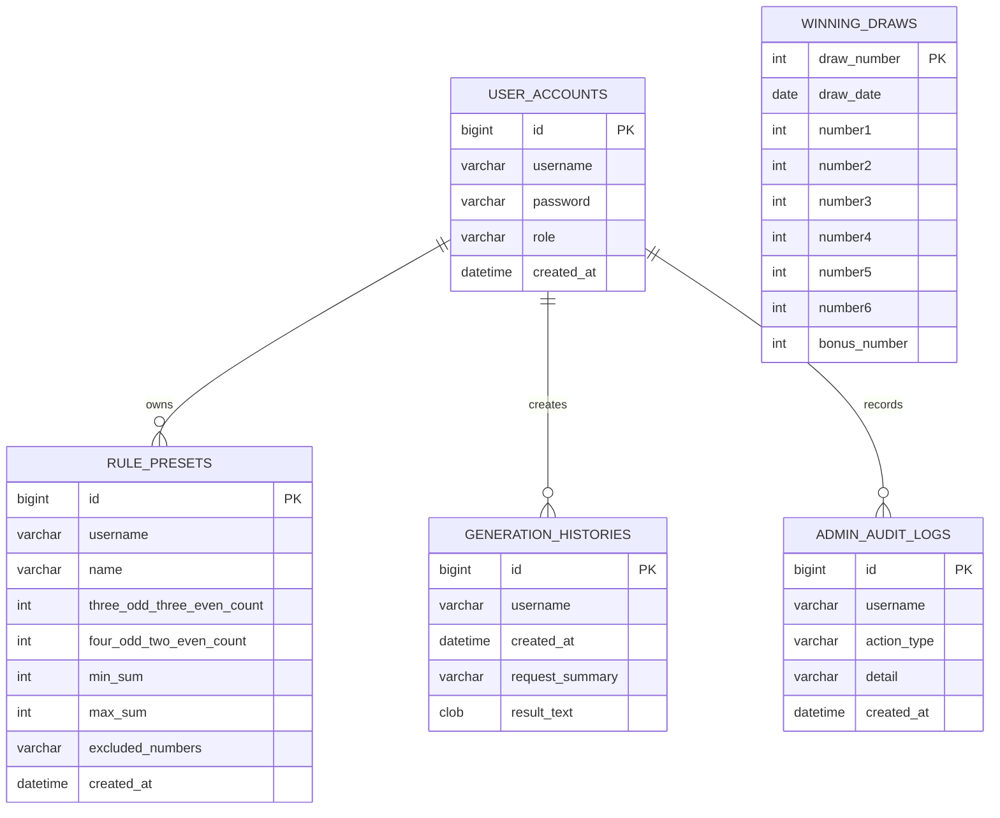

# Lotto Pattern Generator

## 코드 설명 문서

프로젝트 구조와 코드 흐름을 자세히 이해하려면 아래 문서를 먼저 읽어보세요.

- [코드 설명서](docs/CODE_GUIDE.md)
- [STEP 1~19 학습 기록](docs/LEARNING_STEPS_1_19.md)
- [STEP 1~19 대화형 복습 기록](docs/LEARNING_QA_STEPS_1_19.md)
- [AWS 배포 메모](docs/AWS_DEPLOYMENT.md)

로또 당첨번호 데이터를 기반으로 조건에 맞는 후보 번호를 생성하고, 관리자 기능으로 당첨번호를 관리할 수 있는 Spring Boot MVC 프로젝트입니다.

단순 번호 생성기가 아니라 로그인/권한, DB 저장, CSV 업로드, 외부 API 업데이트, 관리자 감사 로그, 통계 대시보드까지 포함하여 실제 운영형 웹 서비스 구조를 연습하는 것을 목표로 만들었습니다.

## 주요 기능

### 사용자 기능

- 회원가입 및 로그인
- 3:3, 4:2 홀짝 패턴 기반 로또 후보 번호 생성
- 생성 개수 제한: 각 패턴별 1~5게임
- 제외수 입력
- 기존 당첨번호와 동일한 조합 제외
- 생성 결과 개별 복사 / 전체 복사
- 규칙 프리셋 저장, 적용, 삭제
- 프리셋 클릭 시 즉시 후보 번호 생성
- 최근 생성 이력 저장
  - 사용자별 최대 3개까지만 유지

### 관리자 기능

- ADMIN / USER 권한 분리
- 당첨번호 수동 저장
- CSV 일괄 업로드
- 외부 API 기반 최신 회차 업데이트
- 최근 저장 회차 조회
- 관리자 감사 로그
  - 수동 저장
  - CSV 업로드
  - 외부 API 업데이트

### 통계 기능

- 번호별 출현 빈도 시각화
- 상위 출현 번호
- 하위 출현 번호
- 홀짝 비율
- 합계 구간 분포
- 저장된 회차 수 기반 대시보드 KPI

## 기술 스택

- Java 17
- Spring Boot 4.0.6
- Spring MVC
- Spring Security
- Spring Data JPA
- H2 Database
- JSP / JSTL
- Maven

## 실행 방법

```bash
./mvnw spring-boot:run
```

Windows 환경:

```bash
mvnw.cmd spring-boot:run
```

실행 후 접속:

```text
http://localhost:8080/login
```

## 기본 계정

애플리케이션 최초 실행 시 기본 관리자 계정이 생성됩니다.

```text
ID: admin
PW: admin1234
Role: ADMIN
```

배포 환경에서는 반드시 기본 비밀번호를 변경해야 합니다.

## 테스트 실행

```bash
./mvnw test
```

Windows 환경:

```bash
mvnw.cmd test
```

## 데이터베이스

현재는 H2 파일 DB를 사용합니다.

```properties
spring.datasource.url=jdbc:h2:file:./data/lotto-db
```

H2 Console:

```text
http://localhost:8080/h2-console
```

JDBC URL:

```text
jdbc:h2:file:./data/lotto-db
```

## 주요 화면

| 화면 | 설명 |
| --- | --- |
| `/login` | 로그인 |
| `/register` | 회원가입 |
| `/generate` | 사용자 번호 생성 화면 |
| `/stats` | 통계 대시보드 |
| `/admin` | 관리자 당첨번호 관리 화면 |

## 주요 엔드포인트

| Method | URL | 권한 | 설명 |
| --- | --- | --- | --- |
| GET | `/login` | PUBLIC | 로그인 페이지 |
| GET | `/register` | PUBLIC | 회원가입 페이지 |
| POST | `/register` | PUBLIC | USER 계정 생성 |
| GET | `/generate` | USER, ADMIN | 번호 생성 화면 |
| POST | `/generate` | USER, ADMIN | 후보 번호 생성 |
| POST | `/presets` | USER, ADMIN | 프리셋 저장 |
| GET | `/presets/{id}/apply` | USER, ADMIN | 프리셋 적용 및 번호 생성 |
| POST | `/presets/{id}/delete` | USER, ADMIN | 본인 프리셋 삭제 |
| GET | `/stats` | USER, ADMIN | 통계 대시보드 |
| GET | `/admin` | ADMIN | 관리자 화면 |
| POST | `/admin/winning-numbers` | ADMIN | 당첨번호 수동 저장 |
| POST | `/admin/winning-numbers/upload` | ADMIN | CSV 업로드 |
| POST | `/admin/winning-numbers/external-update` | ADMIN | 외부 API 업데이트 |

## ERD



## 프로젝트 구조

```text
src/main/java/com/example/lotto
├── config
│   └── SecurityConfig.java
├── controller
│   ├── AuthController.java
│   └── HomeController.java
├── domain
│   ├── AdminAuditLog.java
│   ├── GenerationHistory.java
│   ├── RulePreset.java
│   ├── UserAccount.java
│   ├── UserRole.java
│   └── WinningDrawEntity.java
├── model
├── repository
└── service
```

## 핵심 설계 설명

### 1. 로그인 방식

현재 로그인은 JWT 방식이 아니라 Spring Security의 세션 기반 인증 방식입니다.

로그인 성공 시 서버가 세션을 생성하고, 브라우저에는 `JSESSIONID` 쿠키가 저장됩니다. 이후 요청마다 브라우저가 `JSESSIONID`를 전송하면 서버가 세션을 확인하여 로그인 여부와 권한을 판단합니다.

JSP 기반 서버 렌더링 프로젝트이기 때문에 현재 구조에서는 세션 방식이 자연스럽습니다. 만약 React, Vue, 모바일 앱과 API 서버를 분리한다면 JWT 방식으로 전환할 수 있습니다.

### 2. 권한 분리

권한은 `ADMIN`, `USER`로 분리했습니다.

- USER: 번호 생성, 프리셋 관리, 통계 조회
- ADMIN: USER 기능 + 당첨번호 관리, CSV 업로드, 외부 API 업데이트

Spring Security 설정에서 `/admin/**`, `/h2-console/**`은 ADMIN 권한만 접근할 수 있도록 제한했습니다.

### 3. 후보 번호 생성 로직

사용자가 입력한 조건을 기준으로 후보 번호를 생성합니다.

적용 조건:

- 3:3 홀짝 조합
- 4:2 홀짝 조합
- 합계 범위
- 제외수
- 저빈도 번호 과다 포함 방지
- 특정 마킹 패턴 제한
- 기존 당첨번호와 동일한 조합 제외

생성 개수는 각 패턴별 1~5게임으로 제한했습니다. 화면 input뿐 아니라 서버에서도 검증하여 우회 입력을 막았습니다.

### 4. 당첨번호 관리

당첨번호는 H2 DB에 저장합니다.

관리자는 세 가지 방식으로 데이터를 관리할 수 있습니다.

- 수동 입력
- CSV 일괄 업로드
- 외부 API 업데이트

앱 시작 시 DB가 비어 있으면 `data/winning-numbers.csv`를 기준으로 초기 데이터를 적재합니다.

### 5. 관리자 감사 로그

관리자가 중요한 데이터를 변경하는 작업은 감사 로그로 남깁니다.

기록 대상:

- 당첨번호 수동 저장
- CSV 업로드
- 외부 API 업데이트

이 기능은 실제 운영 환경에서 “누가 언제 어떤 작업을 했는지” 추적하기 위한 기능입니다.

### 6. 통계 대시보드

저장된 당첨번호 데이터를 기반으로 통계를 계산합니다.

- 번호별 출현 횟수
- 최다 출현 번호
- 상위/하위 출현 번호
- 홀짝 비율
- 합계 구간

JSP와 CSS만 사용해 막대 차트 형태로 시각화했습니다.

### 7. 프리셋과 생성 이력

사용자는 자주 쓰는 생성 조건을 프리셋으로 저장할 수 있습니다.

프리셋을 클릭하면 조건을 불러오는 데서 끝나지 않고, 해당 조건으로 즉시 번호를 생성합니다.

최근 생성 이력은 사용자별 최대 3개까지만 저장합니다. 새 이력이 저장되면 오래된 이력은 자동으로 삭제됩니다.

## 면접에서 설명할 포인트

### 이 프로젝트를 한 문장으로 설명하면?

로또 당첨번호 데이터를 DB로 관리하고, 사용자가 설정한 패턴 조건에 따라 기존 당첨번호와 중복되지 않는 후보 번호를 생성하는 Spring Boot MVC 기반 웹 애플리케이션입니다.

### 왜 이 프로젝트를 만들었나요?

단순 CRUD보다 조금 더 실제 서비스에 가까운 흐름을 연습하고 싶었습니다. 로그인, 권한 분리, 관리자 기능, 데이터 업로드, 외부 API 연동, 통계 시각화, 감사 로그처럼 실무에서 자주 만나는 기능을 하나의 작은 서비스 안에 담았습니다.

### 가장 신경 쓴 부분은?

권한 분리와 데이터 관리 흐름입니다. 일반 사용자는 번호 생성과 프리셋만 사용할 수 있고, 당첨번호 변경은 관리자만 할 수 있습니다. 또한 관리자 작업은 감사 로그로 기록해 운영 관점의 추적성을 추가했습니다.

### JWT를 사용했나요?

아니요. 현재는 Spring Security의 세션 기반 인증을 사용했습니다. JSP 기반 서버 렌더링 구조에서는 세션 방식이 단순하고 적합하다고 판단했습니다. 프론트엔드를 React 같은 SPA로 분리한다면 JWT 기반 인증 구조로 변경할 수 있습니다.

### H2를 사용한 이유는?

개발과 포트폴리오 실행 환경에서 별도 DB 설치 없이 바로 실행할 수 있게 하기 위해 H2 파일 DB를 사용했습니다. 다만 JPA Repository 기반으로 작성했기 때문에 추후 MySQL이나 PostgreSQL로 전환하기 쉽습니다.

### 기존 당첨번호 제외는 어떻게 처리하나요?

DB에 저장된 모든 당첨번호 조합을 조회해 문자열 키로 변환한 뒤, 새로 생성된 후보 번호 조합과 비교합니다. 동일한 조합이 있으면 후보에서 제외합니다.

### 보완하고 싶은 점은?

현재는 JSP 기반 MVC 구조이기 때문에 다음 단계에서는 REST API와 프론트엔드를 분리하고, Docker 및 AWS 배포 환경을 구성하고 싶습니다. 또한 Controller 권한 테스트와 통합 테스트를 더 보강할 수 있습니다.

## 앞으로 개선할 수 있는 부분

- Dockerfile, docker-compose.yml 추가
- MySQL 또는 PostgreSQL 프로필 분리
- Controller 권한 테스트 추가
- API 문서화
- React/Vue 프론트엔드 분리
- AWS 배포
- 관리자 비밀번호 변경 기능
